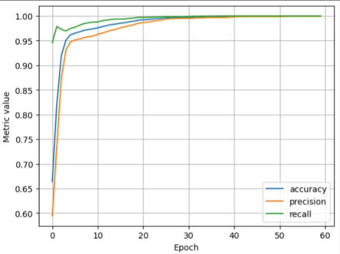
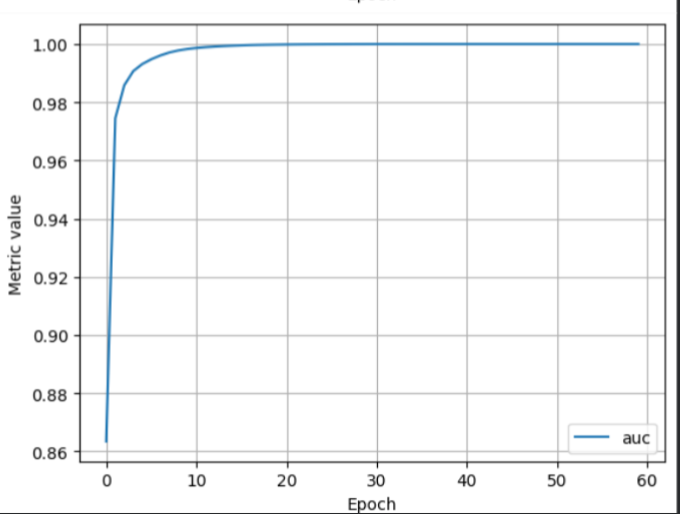

# Mushroom Classifier — Logistic Regression (Keras)

A binary classification model built with Keras to predict whether a 
mushroom is edible or poisonous, from categorical physical characteristics.

## Overview

Third classification project, following the rice species classifier 
(numeric features) and heart disease predictor (mixed numeric/categorical). 
Built to practice one-hot encoding on a dataset where nearly every feature 
is categorical, rather than numeric.

## Dataset

[Mushroom Classification](https://www.kaggle.com/datasets/uciml/mushroom-classification) 
— 8,124 rows, 22 categorical features describing physical traits (odor, 
cap shape, gill color, etc.), with a binary target: edible (`e`) or 
poisonous (`p`).

## What I did

- Mapped the target column to 0/1 (poisonous = 1, edible = 0), same 
  approach as the rice notebook's `Class_Bool` column
- One-hot encoded all 22 categorical feature columns on the full dataset 
  *before* splitting, to guarantee identical columns across train, 
  validation, and test sets
- Split into 80/10/10 train/validation/test
- Built a single-layer logistic regression model in Keras (sigmoid 
  activation), same architecture as the rice classifier
- Evaluated using accuracy, precision, recall, and AUC across all three 
  splits

## Tech stack

Python, Pandas, Keras, TensorFlow

## Results

### Training metrics over epochs

### AUC over epochs

| Metric | Train | Validation | Test |
|---|---|---|---|
| Accuracy | 0.9997 | 1.0000 | 1.0000 |
| Precision | 0.9994 | 1.0000 | 1.0000 |
| Recall | 1.0000 | 1.0000 | 1.0000 |
| AUC | 1.0000 | 1.0000 | 1.0000 |

## Note on model performance

This model achieved ~100% accuracy, precision, recall, and AUC on 
validation and test sets. Verified this wasn't a data leakage bug by 
confirming the target column was excluded from features before encoding.

Instead, this is a known property of the dataset: individual odor values 
are perfectly separable by class. Checked this directly with a crosstab 
of each one-hot encoded odor column against the target:
- `odor = almond` → 400/400 edible
- `odor = creosote` → 192/192 poisonous  
- `odor = foul` → 2160/2160 poisonous

A model can achieve near-perfect accuracy using odor alone, without 
needing any other feature. This makes the dataset a poor benchmark for 
realistic classification difficulty — unlike the heart disease dataset, 
where no single feature comes close to fully separating the classes.

## Bug I hit and fixed

Initially one-hot encoded `train_features`, `validation_features`, and 
`test_features` separately, after splitting. This risked producing 
mismatched column counts across the three sets if a rare category 
happened to appear only in one split. Fixed by one-hot encoding the full 
dataset once, before splitting, guaranteeing identical columns everywhere.

## Key learnings

- Encoding must happen before splitting when using `pd.get_dummies()`, 
  to avoid inconsistent columns across train/validation/test
- A suspiciously perfect result is worth investigating, not just 
  reporting — verified with a crosstab rather than assuming either a bug 
  or a genuinely strong model
- Not every high-scoring model reflects real difficulty in the underlying 
  problem — dataset choice matters when evaluating model quality

## Next steps

- Try training on a feature subset that excludes `odor`, to see how performance drops without the near-perfect predictor
