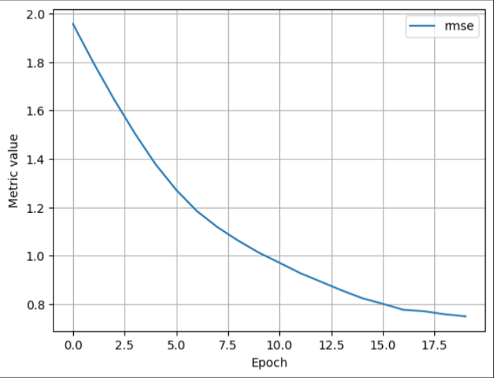
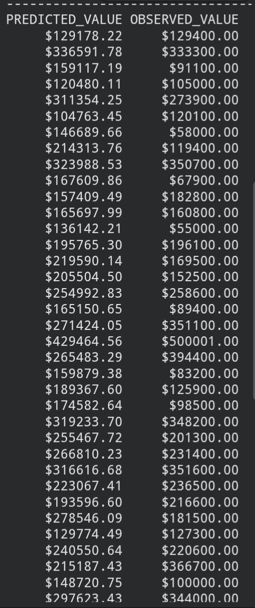

# California Housing Price Predictor

A linear regression model that predicts median house value in California
districts using demographic and geographic features.

## Overview
Built as a self-directed project after completing Google's ML Crash Course
linear regression exercise, using a different (harder, uncleaned) dataset
to practice the full pipeline independently.

## Dataset
[California Housing Prices](https://www.kaggle.com/datasets/camnugent/california-housing-prices)
— 20,640 rows, 10 features (Kaggle, CC0).

## What I did
- Cleaned missing values (207 rows in `total_bedrooms`, dropped)
- One-hot encoded the categorical `ocean_proximity` feature
- Engineered new features: `rooms_per_household`, `bedrooms_per_room`,
  `population_per_household`
- Normalized features using Z-scores
- Trained a linear regression model (Keras) using 7 features
- Evaluated using RMSE and inspected sample predictions vs. actual values

## Tech stack
Python, Pandas, Keras, Plotly

## Results
- RMSE: [fill in your number]
- Example predictions vs observed values in the notebook output

## Key learnings
- Why normalization matters when features are on different scales
- Feature engineering (ratios often help more than raw counts)
- Handling missing data by dropping vs imputing

## Results

### Training loss (RMSE) over epochs

### Sample predictions vs actual values

