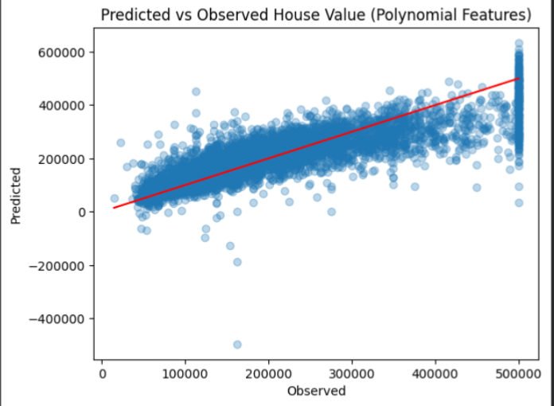
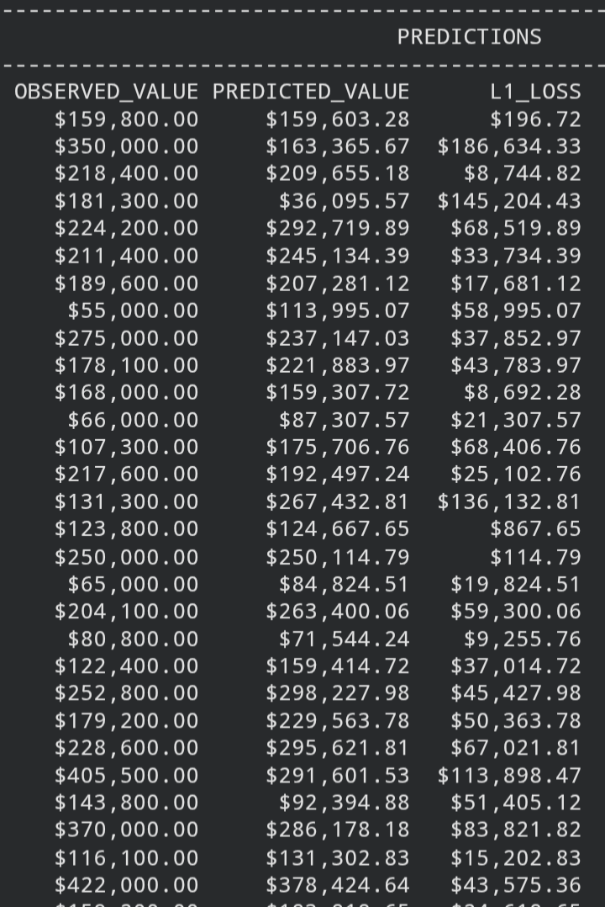

# Housing Price Predictor — Polynomial Regression (scikit-learn)

A polynomial regression model predicting median house value in California 
districts, extending the linear regression baseline by adding squared and 
interaction terms between features.

## Overview

Third implementation in this series, following the plain linear regression 
models (Keras and scikit-learn). Built to test whether a more complex, 
non-linear model improves prediction accuracy over a straight-line fit.

## Dataset

[California Housing Prices](https://www.kaggle.com/datasets/camnugent/california-housing-prices) 
— 20,640 rows, 10 features (Kaggle, CC0).

## What I did

- Cleaned missing values (207 rows in `total_bedrooms`, dropped)
- One-hot encoded the categorical `ocean_proximity` feature
- Engineered new features: `rooms_per_household`, `bedrooms_per_room`, 
  `population_per_household`
- Split into train/test sets *before* generating polynomial features, to 
  avoid leaking test data into feature construction
- Used `PolynomialFeatures(degree=2)` to expand 7 features into 35 
  (squared terms + pairwise interactions)
- Normalized the expanded feature set with `StandardScaler` — important 
  here, since squared terms amplify scale differences even more than raw 
  features
- Trained a `LinearRegression` model on the scaled polynomial features
- Evaluated using RMSE and plotted predicted vs. observed values

## Bug I hit and fixed

Initially trained the model on scaled features but predicted using the 
unscaled test set — a mismatch, since the model expected inputs on a 
normalized scale (mean 0, std 1). Fixed by making sure both training and 
prediction inputs go through the same `StandardScaler` transform.

## Tech stack

Python, Pandas, scikit-learn, Matplotlib

## Results

### Predicted vs Observed

RMSE: **$65,917.94**

### Sample predictions

## Comparison to plain linear regression

| | Linear (sklearn) | Polynomial (sklearn) |
|---|---|---|
| Features | 7 | 35 |
| Normalization | Not required | Required |
| RMSE | $[fill in] | $65,917.94 |

## Key learnings

- Why scaling matters even more with polynomial features, since squared 
  terms exaggerate differences in feature magnitude
- The importance of splitting data *before* transforming it — fitting 
  `PolynomialFeatures` or `StandardScaler` on the full dataset would leak 
  test-set information into training
- Prediction accuracy appears to degrade at higher house values — worth 
  digging into further rather than treating the plot as conclusive
- **Dataset limitation carried over:** `median_house_value` is still 
  capped at $500,001, visible as the vertical band near the right edge

## Next steps

- Compare against `Ridge` and `Lasso` regression (regularized models) as 
  separate follow-up projects
- Try different polynomial degrees (3+) to see if RMSE improves or 
  overfitting worsens
- Investigate whether prediction error actually grows for higher-value 
  homes, using residual plots rather than eyeballing the scatter plot
