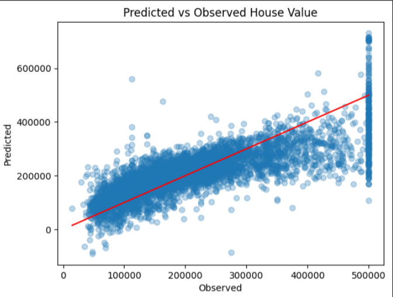
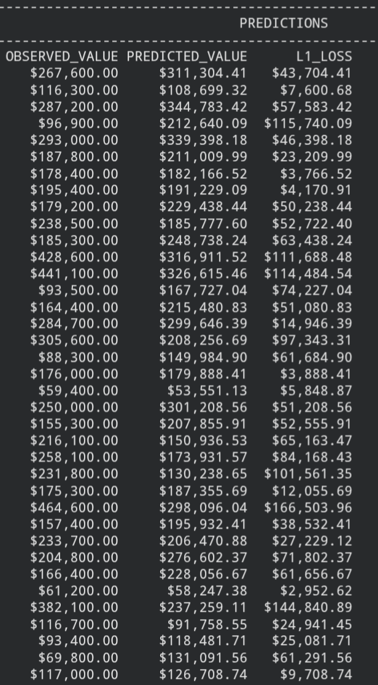

# Housing Price Predictor — scikit-learn Version

A linear regression model predicting median house value in California 
districts, using scikit-learn's closed-form solver.

## Overview

A scikit-learn reimplementation of the [Keras version](../keras/) of this 
project, built to compare a gradient-descent approach against a closed-form 
one on the same problem.

## Dataset

[California Housing Prices](https://www.kaggle.com/datasets/camnugent/california-housing-prices) 
— 20,640 rows, 10 features (Kaggle, CC0).

## What I did

- Cleaned missing values (207 rows in `total_bedrooms`, dropped)
- One-hot encoded the categorical `ocean_proximity` feature
- Engineered new features: `rooms_per_household`, `bedrooms_per_room`, 
  `population_per_household`
- Split data into train/test sets with `train_test_split`
- Trained a `LinearRegression` model on 7 features
- No normalization needed — sklearn's `LinearRegression` solves directly 
  via the normal equation rather than gradient descent, so feature scale 
  doesn't affect the result
- Evaluated using RMSE and plotted predicted vs. observed values

## Tech stack

Python, Pandas, scikit-learn, Matplotlib

## Results

### Predicted vs Observed

RMSE: **$71,745.67**

### Sample predictions

## Key learnings

- Why `LinearRegression` in sklearn doesn't require normalized inputs, 
  unlike gradient-based models
- Feature engineering — ratios (`rooms_per_household`) carry more signal 
  than raw counts
- **Dataset limitation noticed:** `median_house_value` is capped at 
  $500,001 in the raw data — visible as the vertical band of points at 
  the right edge of the predicted vs. observed plot. The model can't 
  predict above what it saw in training, so all capped houses get spread 
  across a wide range of lower predictions.
