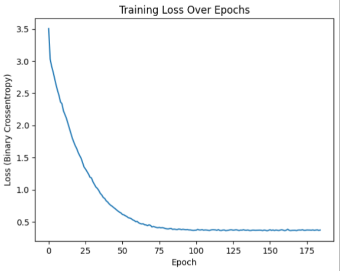
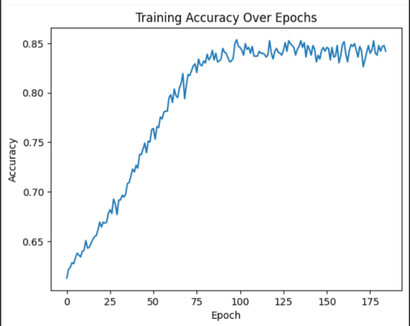
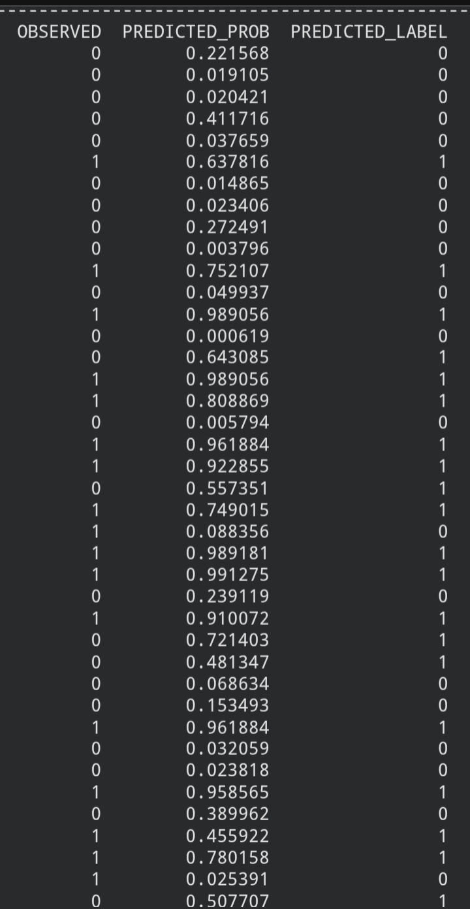

# Heart Disease Predictor — Logistic Regression (Keras)

A logistic regression model built with Keras to predict presence of heart 
disease from patient measurements, with threshold tuning to prioritize 
catching true positives over avoiding false alarms.

## Overview

First classification project built independently, without a matching 
exercise in Google's ML Crash Course, learned the approach from an 
external tutorial and adapted it. Follows the same "clean, train, 
evaluate" pipeline from the linear regression series, applied to a binary 
classification problem for the first time.

## Dataset

[Heart Disease Dataset](https://www.kaggle.com/datasets/johnsmith88/heart-disease-dataset) 
— patient health measurements (age, cholesterol, blood pressure, chest 
pain type, etc.) with a binary target indicating presence of heart disease.

## What I did

- Loaded the dataset and dropped missing rows
- Split into input features and target label
- Built a single-layer logistic regression model in Keras: one `Dense` 
  layer with sigmoid activation, compiled with binary crossentropy loss
- Trained for 189 epochs, tracking loss and accuracy per epoch
- Generated predictions as probabilities, then converted to binary 
  labels using a classification threshold
- Evaluated using precision, recall, and a threshold sweep

## Choosing the classification threshold

Ran a sweep across thresholds from 0.3–0.5 to compare precision/recall 
tradeoffs:

| Threshold | Precision | Recall |
|---|---|---|
| 0.50 | 0.764 | 0.947 |
| 0.45 | 0.727 | 0.952 |
| 0.40 | 0.719 | 0.952 |
| 0.35 | 0.709 | 0.952 |
| 0.30 | 0.705 | 0.952 |

**Chose 0.45.** In a medical screening context, missing a true positive 
(a patient with heart disease going untreated) is more costly than a 
false positive (extra follow-up testing for a healthy patient) so recall matters more than precision here. Recall plateaus at 0.952 from 
0.45 downward, meaning thresholds below 0.45 sacrifice precision with no 
further recall gain. 0.45 sits at the most efficient point on that curve.

## Tech stack

Python, Pandas, Keras, TensorFlow, Matplotlib

## Results

### Training loss over epochs

### Training accuracy over epochs

### Sample predictions

Precision: **0.727** | Recall: **0.952** (at threshold 0.45)

## Key learnings

- Difference between a predicted probability and a predicted label — 
  sigmoid output needs a threshold applied before it becomes a 0/1 call
- Why threshold choice is a judgment call tied to real-world cost of 
  errors, not a fixed default — same logic used in medical screening 
  models (e.g. COVID testing) applies here.
