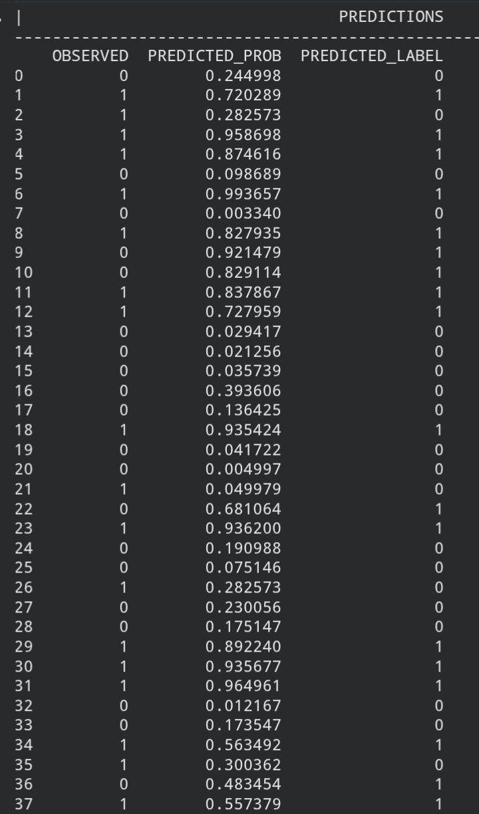

# Heart Disease Predictor — Logistic Regression (scikit-learn)

A logistic regression model built with scikit-learn to predict presence 
of heart disease from patient health measurements, with a custom 
classification threshold applied to prioritize recall.

## Overview

Second implementation of this project, following the Keras version, built 
to compare a closed-form/iterative solver approach (sklearn) against a 
manually-trained neural network layer (Keras) on the same problem.

## Dataset

[Heart Disease Dataset](https://www.kaggle.com/datasets/johnsmith88/heart-disease-dataset) 
— patient health measurements (age, cholesterol, blood pressure, chest 
pain type, etc.) with a binary target indicating presence of heart disease.

## What I did

- Loaded the dataset and dropped missing rows
- Split into input features and target label, then into train/test sets (80/20)
- Trained a `LogisticRegression` model on the training set
- Extracted actual predicted probabilities using `predict_proba()` 
  (not the default `predict()`, which returns hard labels at an internal 
  0.5 threshold "needed real probabilities to apply my own threshold")
- Applied a 0.45 classification threshold, chosen using the same precision/recall reasoning from the Keras version of this project
- Evaluated using a confusion matrix and full classification report

## Bug I hit and fixed

Initially thresholded `model.predict()`'s output directly, not realizing 
sklearn's `LogisticRegression.predict()` already applies its own 0.5 
threshold internally and returns hard 0/1 labels, not probabilities. This 
meant my custom threshold wasn't actually changing anything. Fixed by 
switching to `predict_proba()[:, 1]` to get the actual probability of 
the positive class before applying my own threshold.

## Tech stack

Python, Pandas, scikit-learn, Matplotlib

## Results

At threshold = 0.45:
| | precision | recall | f1-score | support |
|---|---|---|---|---|
| | 0 | 0.88 | 0.77 | 0.82 | 103 |
| | 1 | 0.79 | 0.89 | 0.84 | 102 |
| accuracy | | | 0.83 | 205 |

Confusion matrix:
```
[[79 24]
 [11 91]]
```

### Sample predictions





## Comparison to Keras version

| | Keras | scikit-learn |
|---|---|---|
| Approach | Single-layer sigmoid, trained via gradient descent | Closed-form logistic regression |
| Threshold used | 0.45 | 0.45 |

## Key learnings

- The difference between `predict()` and `predict_proba()` in sklearn `predict()` silently applies its own default threshold, which can quietly break custom threshold logic if you're not aware of it
- Reused the same recall-prioritized threshold reasoning from the Keras version, applied to a different underlying model
- Confusion matrix breakdown: 11 false negatives (missed true heart disease cases) vs. 24 false positives, consistent with prioritizing recall over precision
